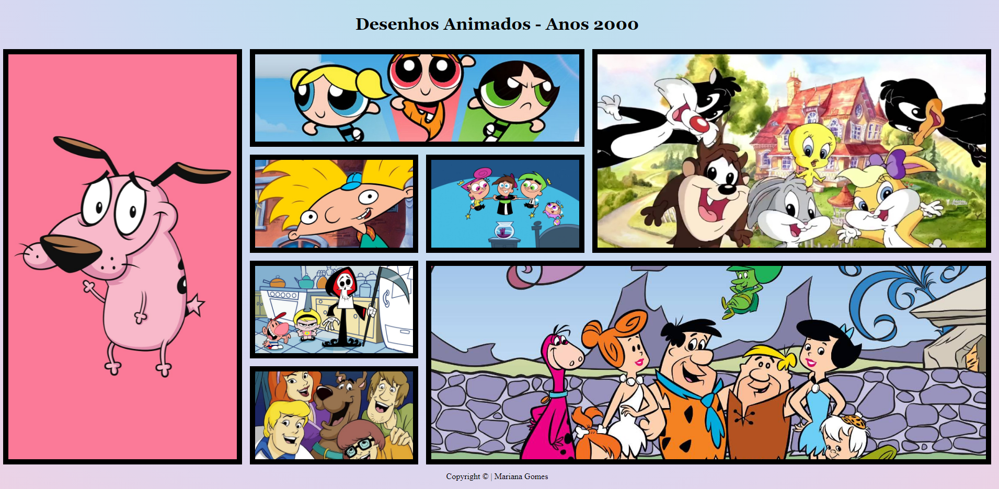

# Galeria-Grid

Esse projeto foi desenvolvido durante as aulas de Linguages de Marcação para fins didáticos no [SENAI Jandira](https://jandira.sp.senai.br/), sob orientação do Professor [Fernando Leonid](https://github.com/fernandoleonid). 

## Objetivo
O objetivo principal foi criar uma galeria com imagens em tamanhos e formatações diferentes, usando assim a tag *grid* para otimizar o código do projeto.

## Website
O site pode ser acessado pelo link: [Mariana Gomes](https://marianasgit.github.io/Galeria-Grid/)

# Tecnologias
* HTML5
* CSS3
* VSCODE

# Screenshot
